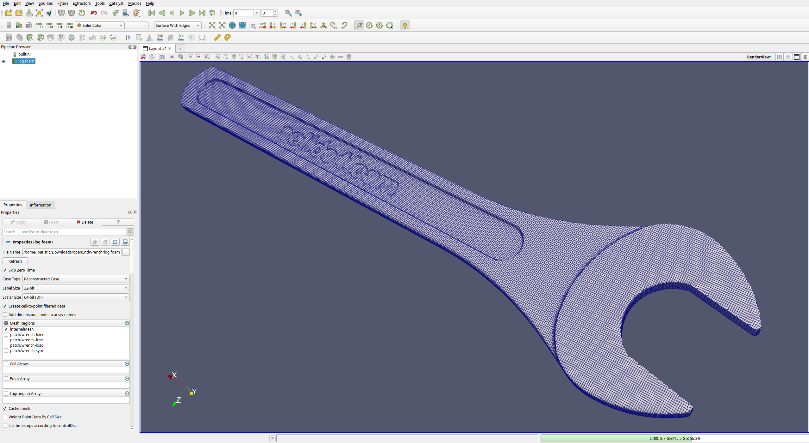
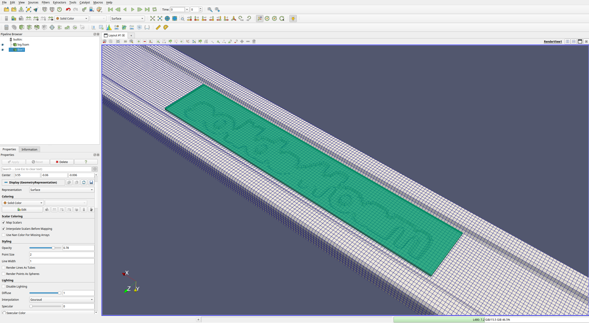
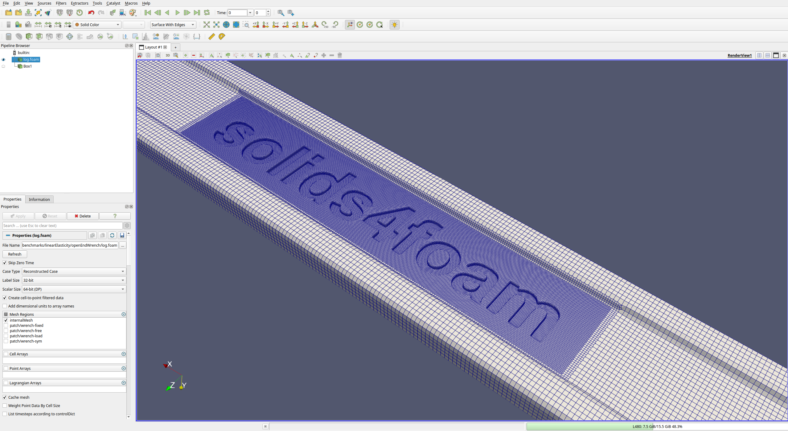

# Building custom solid case: `openEndWrench`

Prepared by: Ivan Batistić and Philip Cardiff

---

## Tutorial Aims

This guide covers the step-by-step process of building a custom solid case from scratch. It explains how to generate the mesh for the provided geometry, set up patches for boundary conditions, use the `cfMesh` mesh generator, apply boundary and initial conditions, solve the problem, and post-process the results. We’ll demonstrate each stage using a specific example: creating a case for an open-end wrench.

##  Prerequisites

Prerequisites for this tutorial are:

- `solids4foam-v2.1`
- `openfoam2312`
- `ParaView-5.13.2`

It is possible to follow the tutorial steps with other `OpenFOAM` and `ParaView` versions, but be aware of possible minor differences.

## Step 1. Preparing Case Geometry

Before using geometry for simulations, it’s essential to ensure the geometry is clean and free of flaws that could compromise mesh generation. Common flaws to address include non-manifold edges, self-intersecting surfaces, gaps, overlapping faces, very sharp angles, improper units, disconnected bodies,  tolerance issues and others. These can be resolved using any CAD software. In this example, geometry preparation was done using Rhino, but other software such as Blender or Salome can also be used. The case geometry is an open-end wrench, as shown in the figure below.


*Case geometry*

For `cfMesh`, the prepared geometry should be exported in `stl` format (preferably written in `ascii` format). Before exporting, it’s advisable to divide the surface so that each portion corresponds to the boundary condition that will be applied later in the simulation. In this case, we distinguish between the faces where zero displacement will be prescribed and the surfaces where the load will be applied. These surfaces are shown in the image below, with the load surface marked in green and the fixed displacement surface in red. Overall, this means the wrench geometry is divided into three `.stl` files: `wrench-fixed.stl`, `wrench-free.stl`, and `wrench-load.stl`. 


_Case geometry: load surface (green) and fixed surface (red)_

```tip
When exporting geometry to STL format, you can control the fineness of the surface triangulation. Make it fine enough to accurately describe the geometry, but avoid creating an STL file that is too large, as this will increase meshing time.
```

To download the geometry, first, we need  to open the terminal and create a case directory at a location of your choice:  
```bash
$ mkdir openEndWrench
$ cd openEndWrench        
```

Next, download the geometry using the following command:  
```bash
wget https://raw.githubusercontent.com/solids4foam/solid-benchmarks.git/main/path/to/file
```

Before proceeding to the next phase, we will set up the `SOLIDS4FOAM_DIR` variable to point to the `solids4foam` folder. Since this location is user-dependent, this will ensure that the subsequent commands are applicable to all users.

```bash
$ echo 'export SOLIDS4FOAM_DIR=~/path-to-solids4foam/' >> ~/.bashrc
$ source ~/.bashrc
```

## Step 2. Meshing using cfMesh

Before proceeding to the meshing phase, we need to populate the case directory with the necessary `OpenFOAM` folders and files. The most efficient way to do this is by finding the most similar case and copying its structure. For our simulation, which assumes small deformations and a linear elastic material, the cases in `solids4foam/tutorials/solids/linearElasticity` are the most suitable.  For this case, we will copy case structure from the `plateHole` tutorial case:

```bash
$ cp -r $SOLIDS4FOAM_DIR/tutorials/solids/linearElasticity/plateHole/* .
```

Meshing with cfMesh is controlled using the `meshDict` file. Since `cfMesh` is included in the `OpenFOAM` distribution (at least for version `v2312`), we can find examples of this file either in the `OpenFOAM` tutorials or the `solids4foam` tutorials:

```bash
$ cd $SOLIDS4FOAM_DIR
$ find . -name meshDict
```

which will result in the following files:

```bash
./tutorials/fluidSolidInteraction/microBeamInCrossFlow/system/fluid/meshDict
./tutorials/fluidSolidInteraction/microBeamInCrossFlow/system/solid/meshDict
./tutorials/solids/linearElasticity/wobblyNewton/system/meshDict
./tutorials/solids/linearElasticity/punch/system/punch_bottom/meshDict
./tutorials/solids/linearElasticity/punch/system/punch_top/meshDict
```

We will use the `meshDict` from the `wobblyNewton` tutorial case. The file should be located under the `system` folder (locate your terminal in`openEndWrench` directory):

```bash
$ cp $SOLIDS4FOAM_DIR/tutorials/solids/linearElasticity/wobblyNewton/system/meshDict system/.
```

If we open the `meshDict` file, we will see three entries. The first one specifies the file to be meshed, the second defines the maximum cell size, and the third controls the size on the boundary.

```plaintext
surfaceFile "newtonDecimated.stl";
maxCellSize 0.005;
boundaryCellSize 0.0025;
```

The next step is to prepare the file to be meshed. Since we have divided our surface into three `stl` files, we need to combine them into one `stl` file. Before combining, we must open each `stl` file and rename the beginning and end of the file to match the `stl` name. For example for `wrench-free` file we need to replace `OBJECT` in the first and the last line with `wrench-free`.
```plaintext
solid OBJECT
  facet normal 0.17364834595052386 0 0.98480772333925526
    ...
	...
	...
   endloop
 endfacet
endsolid OBJECT
```

to 
```plaintext
solid wrench-free
  facet normal 0.17364834595052386 0 0.98480772333925526
    ...
	...
	...
   endloop
 endfacet
endsolid wrench-free
```

Now, we can combine the `stl` files into one `stl` file:

```bash
$ cat *.stl > wrench.stl
```

`cfMesh` prefers the `fms` format over the `stl` format, so we will convert `stl` to` fms` using following command:

```bash
$ surfaceToFMS wrench.stl 
```

Now we can adjust the `meshDict` and try to generate a mesh. Set the entries in the `meshDict` as follows,

```plaintext
surfaceFile "newtonDecimated.stl";
maxCellSize 0.016;
boundaryCellSize $maxCellSize;
```

and run the mesher using following command (after which we will use `paraFoam` to visualize it):

```bash
$ cartesianMesh
$ paraFoam
```



One can see that the mesh size is sufficient to describe the geometry. However, if we want to capture smaller features, such as the engraved letters, we need to refine the mesh in that region. To do so, we can refer to the `cfMesh` [user guide](https://cfmesh.com/wp-content/uploads/2015/09/User_Guide-cfMesh_v1.1.pdf), which details the available meshing features. In this case, we will refine the mesh within a box zone. To determine the box's center and size, we can use *Sources > Alphabetical > Box* in `paraFoam`.



Now we can add the box refinement in the `meshDict` file:

```plaintext
surfaceFile "newtonDecimated.stl";
maxCellSize 0.018;
boundaryCellSize $maxCellSize;

objectRefinements
{
    box
    {
        type box;
        cellSize 0.01;
        centre (3.55 -0.06 -0.006);
        lengthX 1.8;
        lengthY 0.05;
        lengthZ 0.3;
    }
}
```

Afterward, we will run the mesher again,

```bash
$ cartesianMesh
$ paraFoam
```

and check mesh in paraView. 



To check if the mesh is suitable for running, we will use the `checkMesh` utility:

```bash
$ checkMesh
```

From the output of `checkMesh`, we can see that the mesh passed the test and is suitable for use:

```plaintext
Checking geometry...
    Overall domain bounding box (-0.688933 -0.137819 -0.832673) (5.88764 0.137824 0.784275)
    Mesh has 3 geometric (non-empty/wedge) directions (1 1 1)
    Mesh has 3 solution (non-empty) directions (1 1 1)
    Boundary openness (-7.50451e-18 -1.36397e-14 -9.02428e-16) OK.
    Max cell openness = 3.42099e-16 OK.
    Max aspect ratio = 8.55694 OK.
    Minimum face area = 1.46395e-06. Maximum face area = 0.000459851.Face area magnitudes OK.
    Min volume = 4.44711e-09. Max volume = 4.9307e-06.  Total volume = 0.908646.  Cell volumes OK.
    Mesh non-orthogonality Max: 61.3459 average: 3.34755
    Non-orthogonality check OK.
    Face pyramids OK.
    Max skewness = 1.48466 OK.
    Coupled point location match (average 0) OK.
Mesh OK.
```

From the `Overall domain bounding box` line, we can see that the bounding box for our mesh is 6.5 meters in the x-direction, which suggests that we have scaling issues. This typically happens when the mesh is created in millimeters but exported in meters, or vice versa. To fix this, we can simply scale the mesh using the following command:

```bash
scaleMesh 0.001
```

Additionally, the `checkMesh` output shows that the boundary patches correspond to the names of the `stl` files, and we can use these patch names to set up the boundary conditions in the `0` directory."

```plaintext
Checking patch topology for multiply connected surfaces...
                   Patch    Faces   Points  Surface topology
            wrench-fixed     1410     1487  ok (non-closed singly connected)
             wrench-free    98836    99462  ok (non-closed singly connected)
             wrench-load      956     1080  ok (non-closed singly connected)
                    ".*"   101202   101489      ok (closed singly connected)
```

The same patch names are written in the `constant/polyMesh/boundary` file, which in our case looks like this:

```plaintext
3
(
wrench-fixed
{
    type wall;
    nFaces 1410;
    startFace 1780995;
}

wrench-free
{
    type wall;
    nFaces 98836;
    startFace 1782405;
}

wrench-load
{
    type wall;
    nFaces 956;
    startFace 1881241;
}

)
```

The type `wall` is used for fluid simulations. For solid simulations, we need to replace it with the `patch` type:
```plaintext
3
(
wrench-fixed
{
    type patch;
    nFaces 1410;
    startFace 1780995;
}

wrench-free
{
    type patch;
    nFaces 98836;
    startFace 1782405;
}

wrench-load
{
    type patch;
    nFaces 956;
    startFace 1881241;
}

)

```

The mesh is now ready, and we can proceed to the next step.

## Step 3. Preparing Case Files

First, we will open the `constant/mechanicalProperties` file to adjust the material properties. 
```
planeStress     no;

mechanical
(
    steel
    {
        type            linearElastic;
        rho             rho [1 -3 0 0 0 0 0] 7854;
        E               E [1 -1 -2 0 0 0 0] 200e+9;
        nu              nu [0 0 0 0 0 0 0] 0.3;
    }
);
```

 After inspecting the file, we can see that the properties match those of steel, so we can leave the file as it is.  

In the `constant/solidProperties` file, we choose the solver type, solution tolerances, and the maximum number of iterations per time step (`nCorrectors`). The `materialTolerance` keyword is used only in the case of a nonlinear material law, and the `infoFrequency` setting adjusts when the residuals will be logged in the terminal. The solver`linearGeometryTotalDisplacement`, is a segregated solver for small strains and rotations. For a list of the solid models currently available in `solids4foam`, refer to this [page](https://www.solids4foam.com/documentation/solid-models.html).

```plaintext
// linearGeometry: assumes small strains and rotations
solidModel     linearGeometryTotalDisplacement;

"linearGeometryTotalDisplacementCoeffs"
{
    // Maximum number of momentum correctors
    nCorrectors     1000;

    // Solution tolerance for displacement
    solutionTolerance 1e-06;

    // Alternative solution tolerance for displacement
    alternativeTolerance 1e-07;

    // Material law solution tolerance
    materialTolerance 1e-05;

    // Write frequency for the residuals
    infoFrequency   100;
}
```

The remaining files, `physicalProperties`, `dynamicMeshDict`, and `g` in the `constant` directory, can remain unchanged. For this type of solid simulation, only the `g` file should be modified if we want to include gravitational effects

Next, in the `0/D` file, we need to set up boundary and initial conditions. For the initial conditions, we can assume zero displacement in all cells, which is set up on line 21:

```c++
internalField   uniform (0 0 0);
```

Within the curly brackets of the `boundaryField` keyword, we need to set the boundary condition for each patch. For solid simulations, the most common boundary conditions are prescribed displacement, traction, or symmetry. In this case, we need to apply pressure to the `wrench-load` patch, zero displacement to the `wrench-fixed` patch, and traction-free conditions to the remaining boundary, `wrench-free`.  Finally, the `0/D` file should look like this:

```c++
boundaryField
{
    wrench-fixed
    {
        type            fixedDisplacement;
        value           uniform (0 0 0);
    }
    wrench-load
    {
        type            solidTraction;
        traction        uniform ( 0 0 0 );
        pressure        uniform 1e4;
        value           uniform (0 0 0);
    }
    wrench-free
    {
        type            solidTraction;
        traction        uniform ( 0 0 0 );
        pressure        uniform 0;
        value           uniform (0 0 0);
    }
}
```

The entries in `system/fvSchemes` and `system/fvSolution` suit our needs, so we can leave them as they are. In the `system/controlDict`, we need to set `endTime` to 1, as we are solving a static simulation with one load increment and no time marching. The `forceDisp1` entry in `functions` should be removed, and for `pointDisp`, we can set the value to `(0.0055 0 0)` to monitor the wrench end deflection.

## Step 4. Running the Case

To run the case, we can use the existing `Allrun` script; however, we need to modify it by removing the line that generates the mesh using `blockMesh`. Finally, the `Allrun` script should look like this:
```bash
#!/bin/bash

# Source tutorial run functions
. $WM_PROJECT_DIR/bin/tools/RunFunctions

# Source solids4Foam scripts
source solids4FoamScripts.sh

# Check case version is correct
solids4Foam::convertCaseFormat .

# Run solver
if [[ "${1}" -gt 1 ]]
then
    # Number of cores passed as an argument
    solids4Foam::runApplication decomposePar
    solids4Foam::runParallel solids4Foam "${1}"
    solids4Foam::runApplication reconstructPar
else
    # Case runs in serial if no argument is passed or if the argument is 1
    solids4Foam::runApplication solids4Foam
fi
```


## Step 5. Analysing the Results